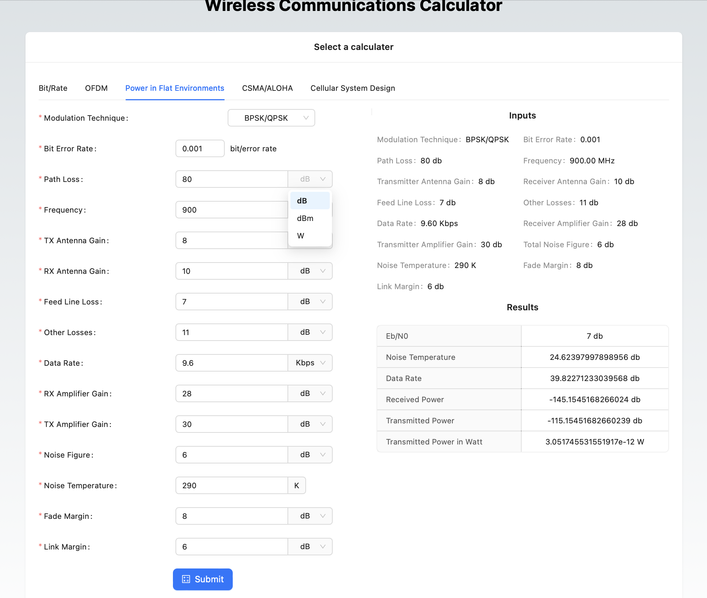

# Wireless Networks Online Calculator

## Demo

TODO: Add a link to the demo

TODO: Add a lot of screenshots

## Installation

- Install [Node.js](https://nodejs.org/en/download/) if you haven't already.

- Clone the repository:

  ```bash
  git clone https://github.com/ibraheemalayan/WirelessCommunicationsDesignOnlineCalculator
  cd WirelessCommunicationsDesignOnlineCalculator
  ```

- Install dependencies:

  ```bash
  npm install
  ```

- Run the development server:

  ```bash
  npm run dev
  ```

- Open [http://localhost:3000](http://localhost:3000) with your browser to see the result.

## Screenshots

The number of bits and rate of the sampler, quantizer, source encoder, channel encoder, and
interleaver.


The number of bits and rate for resource elements, OFDM symbol, Resource Blocks, and
maximum transmission using parallel resource blocks.


Power transmitted in a flat environment based on the transmitter and receiver specifications.



Throughput in percent of Multiple Access techniques.


Design of cellular system.


